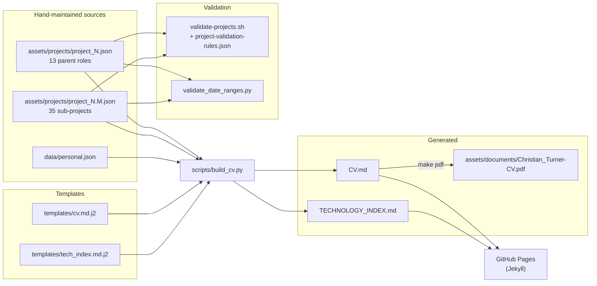

# Architecture and Data Flow

This document describes the pipeline as it exists in the code on the `revision` branch. Where it differs from `docs/build-pipeline-reference.md` or `docs/project-schema-reference.md`, the code is authoritative. See [Current State and Gaps](./current-state-and-gaps.md) for a list of the differences.

## System Diagram



`index.md` and `Resume.md` are also published, but no script touches them.

## Inputs

### Project files

Every file in `assets/projects/` named `project_*.json` is loaded, except `project_template.json`. Each file has a single root key, `project`.

The `number` field defines the file's role:

- An **integer** number (for example, `13`) marks a **parent role**: one engagement at one client.
- A **decimal** number (for example, `13.1`) marks a **sub-project**: one deliverable inside that engagement. Its parent is `floor(number)`.

The file name follows the number, but the build uses the `number` field, not the file name.

#### Fields used today

| Field | Parent files | Sub-project files | Used by |
|-------|--------------|-------------------|---------|
| `number`, `title`, `client`, `role`, `date_range` | Yes | Yes | Headings, metadata lines, table of contents |
| `role_overview.summary` | Yes (all 13) | No | Opening paragraph under each role heading |
| `parentsummary.deliverables` | No | Yes (all 35) | Rolled up into the parent's "Workstream Deliverables" list |
| `parentsummary.outcomes` | No | Yes (all 35) | Rolled up into the parent's "Engagement Outcomes" list |
| `challenge.summary` | Yes | Yes | Sub-project description paragraph |
| `solution.summary`, `solution.deliverables` | Yes | Yes | Sub-project deliverables list |
| `outcomes` | Yes | Yes | Sub-project "Project Outcomes" list |
| `technologies[].category`, `technologies[].items` | Yes | Yes | Sub-project "Technical Environment" and the technology index |

On parent files, `challenge`, `solution`, and `outcomes` are required by validation but are **not rendered** in `CV.md` today. This is because every parent currently has at least one sub-project, and the template only renders those parent fields for a parent with no sub-projects. Parent `technologies` are still collected into the technology index.

### Personal data

`data/personal.json` has three top-level keys:

| Key | Contents | Rendered as |
|-----|----------|-------------|
| `personal` | Name, title, tagline, subtitle, email, phone, location, links (LinkedIn, GitHub, NotebookLM), consulting entity | CV header block |
| `professional_profile` | `summary` (three paragraphs) and `certifications` (name, issuer, certificate URL, issue date, expiry date, credential ID) | "Professional Profile" section |
| `executive_summary` | Specialization, government clients, compliance depth, cloud platforms, current engagement, availability | "Executive Summary" bullet list |

## Build Logic

`scripts/build_cv.py` runs these steps in `render()`:

1. **Load.** Read `data/personal.json`. Glob and parse every project file, excluding the template.
1. **Classify.** Split projects into parents (integer numbers) and sub-projects (decimal numbers), keyed by parent number.
1. **Group.** For each parent number, in descending order, build a group containing the parent's data and its sub-projects sorted in ascending order.
1. **Synthesise missing parents.** If sub-projects exist with no parent file, create a parent from the first sub-project's title, client, and role. Its date range spans the earliest start and latest end of its sub-projects. No such case exists in the current data.
1. **Roll up.** If a group has sub-projects and the parent has `role_overview`, copy each sub-project's `parentsummary.deliverables` and `parentsummary.outcomes` into `role_overview.deliverables` and `role_overview.outcomes`. The original dictionary is not modified.
1. **Build the alphabetical technology index** (`build_tech_index`). Collect every technology item from parents and sub-projects, map it to the project numbers that list it, and bucket by first letter. This is passed to `cv.md.j2` as `tech_index`, but the current template does not use it.
1. **Build the grouped technology index** (`build_grouped_tech_index`). Assign each technology to a domain group through the hard-coded `TECH_GROUP_MAP` dictionary. Names not in the map fall back by prefix: `AWS` or `Amazon` goes to Amazon Web Services, `Azure` or `Microsoft Azure` goes to Microsoft Azure, and everything else goes to "Uncategorised". Groups are emitted in the order of `TECH_GROUPS_ORDER` (18 groups).
1. **Render `CV.md`** with `templates/cv.md.j2`. The Jinja2 environment uses `trim_blocks` and `lstrip_blocks`, and registers an `anchor` filter that creates GitHub-style heading anchors for the table of contents.
1. **Render `TECHNOLOGY_INDEX.md`** with `templates/tech_index.md.j2`.

### Command-line options

| Option | Default | Effect |
|--------|---------|--------|
| `--output PATH` | `CV.md` | Changes the CV output path only |
| `--template NAME` | `cv.md.j2` | Changes the CV template (looked up in `templates/`) |

`TECHNOLOGY_INDEX.md` is always written to the repository root, even when `--output` is set.

## Outputs

### `CV.md` structure

1. Header: name, contact line, links, tagline, subtitle.
1. **Professional Profile:** summary paragraphs and certification list with links to PDFs.
1. **Executive Summary:** six labelled bullets.
1. **Table of Contents:** one entry per role and sub-project, plus a link to `TECHNOLOGY_INDEX.md`.
1. **Professional Experience:** for each role, from newest to oldest:
    - Heading `## N. Project N - Title`, then client, role, and dates.
    - `role_overview.summary`, then "Workstream Deliverables" and "Engagement Outcomes" (the roll-up).
    - For each sub-project: heading `### Project N.M — Title`, dates, challenge, solution deliverables, outcomes, and technical environment.
1. Footer: a hard-coded "Last updated" line.

### `TECHNOLOGY_INDEX.md` structure

One `##` heading per non-empty domain group, in fixed order. Under each heading is an alphabetical list in the form `**Technology** — Projects N, N.M`.

### PDF

`make pdf` converts `CV.md` to `assets/documents/Christian_Turner-CV.pdf` using Pandoc with XeLaTeX (letter paper, 11 pt Helvetica Neue, 1-inch margins, table of contents to depth 2). This step requires Pandoc and a TeX distribution. The build does not run it automatically.

## Validation Layer

Validation is separate from the build. `build_cv.py` does not validate its inputs.

| Check | Implementation | What it enforces |
|-------|----------------|------------------|
| Schema and content | `tests/validators/validate-projects.sh` driven by `project-validation-rules.json` | Valid JSON, required fields, field types, non-empty strings and arrays, number format and range, technology object shape |
| Date containment | `tests/validators/validate_date_ranges.py` | Each sub-project's date range falls inside its parent's date range |

The rules file has five categories: `format`, `required_fields`, `type_validation`, `content_validation`, and `constraint_validation`. Adding a rule to the JSON file needs no script change, as long as the validator already supports the rule's check type.

`role_overview` and `parentsummary` are not checked by any rule.

## Make Targets

| Target | Action |
|--------|--------|
| `make install` | `pip install -r requirements.txt` |
| `make validate` | Loops over project files and runs `validate-projects.sh --quiet` on each. Prints failures and a pass/fail count. |
| `make build` | `python3 scripts/build_cv.py` |
| `make pdf` | Pandoc export of `CV.md` |
| `make all` | `validate`, then `build`, then `pdf` |

`make validate` does not run `validate_date_ranges.py`.

## Publishing

There is no CI workflow in the repository (no `.github/` directory). Publishing depends on committing the generated files and on GitHub Pages building the site from the branch it is configured to serve.

Jekyll settings in `_config.yml`:

- Theme: `jekyll-theme-minimal`
- Markdown engine: `kramdown`
- Plugins: `jekyll-feed`, `jekyll-seo-tag`

## Reproducibility

The build is deterministic for the committed inputs. During this review, all tracked files were copied to a scratch directory and the following was run:

```bash
make validate
python3 tests/validators/validate_date_ranges.py
python3 scripts/build_cv.py
diff -q CV.md <repo>/CV.md
diff -q TECHNOLOGY_INDEX.md <repo>/TECHNOLOGY_INDEX.md
```

Results:

```text
Validation complete: 48 passed, 0 failed
Date range validation: 35 sub-projects checked, 0 violation(s) — passed
Generated: .../CV.md
  Projects: 35 entries across 13 roles
Generated: .../TECHNOLOGY_INDEX.md
```

Both `diff -q` commands printed nothing. The committed `CV.md` and `TECHNOLOGY_INDEX.md` match what the committed inputs produce.
